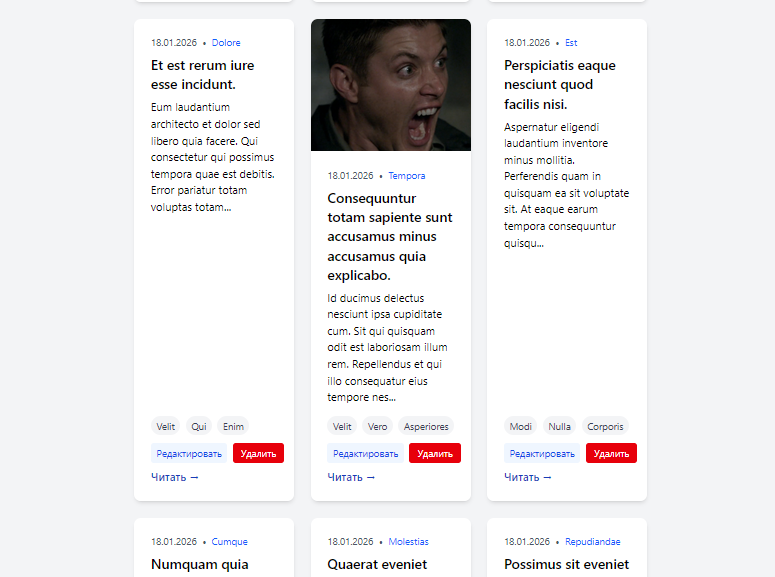
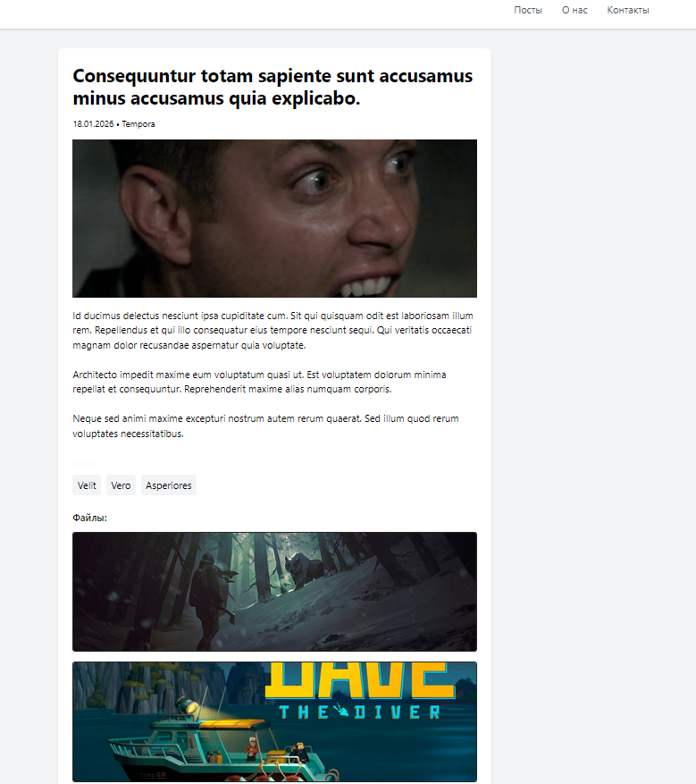
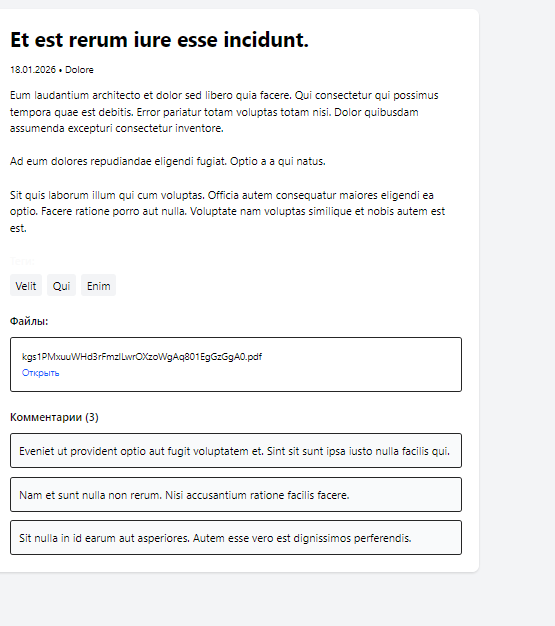
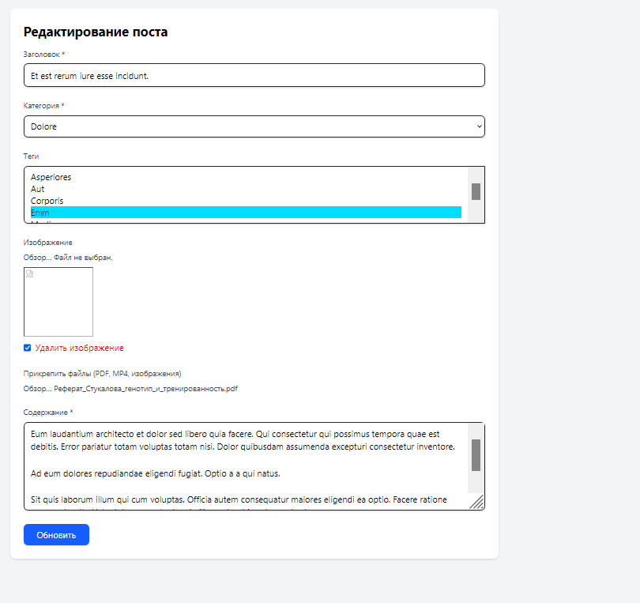

<div align="center">

# PostLab

**Personal blog CMS · Laravel 12 lab project**

Create posts, attach files, manage categories & tags — clean card UI.

[](https://laravel.com)
[](https://www.php.net)
[](https://react.dev)
[](https://inertiajs.com)
[](https://www.sqlite.org)

**Suggested repo name:** `PostLab`  
*(rename `labs` → Settings → General)*


</div>

---

A university coursework blog built as six Laravel labs. The app lives in `my-personal-blog/`; UI labels are in Russian.

## Features

- **Posts CRUD** — create, edit, delete, and read full articles
- **Categories & tags** — one category + multi-select tags
- **Cover images** — optional hero image on each post
- **Attachments** — PDF, MP4, and images (`s3-fake` disk)
- **Comments** — discussion thread on the post page
- **Search & filters** — by title, category, popularity
- **Auth** — Fortify login / register / 2FA (Inertia + React)

## Screenshots

<table>
  <tr>
    <td width="50%">
      
      <p align="center"><sub>Posts grid — cards with edit / delete / read</sub></p>
    </td>
    <td width="50%">
      
      <p align="center"><sub>Post detail — cover, body, image gallery</sub></p>
    </td>
  </tr>
  <tr>
    <td width="50%">
      
      <p align="center"><sub>PDF attachments & comments</sub></p>
    </td>
    <td width="50%">
      
      <p align="center"><sub>Edit form — category, tags, media</sub></p>
    </td>
  </tr>
</table>

## Quick start

```bash
git clone https://github.com/top-secret666/labs.git
cd labs/my-personal-blog

composer install
cp .env.example .env && php artisan key:generate
touch database/database.sqlite
php artisan migrate --seed

npm install && npm run build
php artisan storage:link
mkdir -p storage/app/s3-fake
ln -sfn ../storage/app/s3-fake public/s3-fake

composer run dev
```

Open **http://127.0.0.1:8000** · main routes: `/posts`, `/posts/create`, `/about`, `/contact`, `/login`

**Requires:** PHP 8.2+, Composer, Node.js 20+, SQLite (`gd`/`imagick` recommended)

## Stack

| | |
| --- | --- |
| Backend | Laravel 12 · Eloquent · Blade (blog) · Fortify |
| Frontend | React 19 · Inertia.js · Tailwind CSS 4 · Vite |
| Data / media | SQLite · `public` covers · `s3-fake` attachments · Spatie image-optimizer |


## Name

| Name | Why |
| --- | --- |
| **`PostLab`** ⭐ | Short — *posts* + *labs*; matches the screenshots |
| `laravel-personal-blog` | Explicit stack + product |
| `blog-cms-lab` | Emphasizes CMS + coursework |

**GitHub description:** `Personal blog CMS (Laravel 12) — posts, tags, comments, media. University lab project.`
